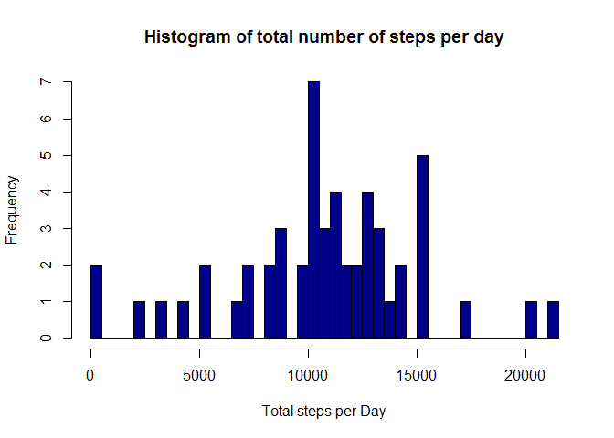
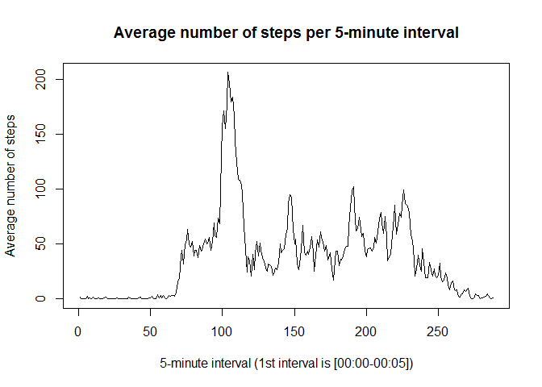
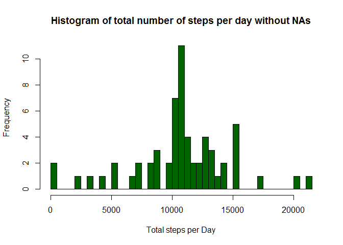
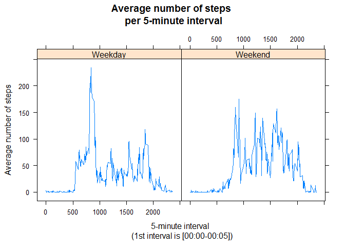

# Reproducible Research: Peer Assessment 1


## Loading and preprocessing the data

We first read the raw data from the `.zip` file that (we assume) is in our current working directory into the data frame `data`.


```r
if (!file.exists("activity.csv")){
  unzip("activity.zip")
}

data <- read.csv("activity.csv")
str(data)
```

```
## 'data.frame':	17568 obs. of  3 variables:
##  $ steps   : int  NA NA NA NA NA NA NA NA NA NA ...
##  $ date    : Factor w/ 61 levels "2012-10-01","2012-10-02",..: 1 1 1 1 1 1 1 1 1 1 ...
##  $ interval: int  0 5 10 15 20 25 30 35 40 45 ...
```

We convert the date column into `POSIXct` format, which will be useful later when applying the ``weekdays()` function.


```r
data$date <- as.POSIXct(data$date, tz="GMT")
str(data)
```

```
## 'data.frame':	17568 obs. of  3 variables:
##  $ steps   : int  NA NA NA NA NA NA NA NA NA NA ...
##  $ date    : POSIXct, format: "2012-10-01" "2012-10-01" ...
##  $ interval: int  0 5 10 15 20 25 30 35 40 45 ...
```


## What is mean total number of steps taken per day?

We make a data frame containing the total number of steps for each day. We ignore `NA` values.


```r
totalstepsPerDay <- aggregate(data$steps, by = list(data$date), FUN=sum)
names(totalstepsPerDay) <- c("date", "totalsteps")
head(totalstepsPerDay)
```

```
##         date totalsteps
## 1 2012-10-01         NA
## 2 2012-10-02        126
## 3 2012-10-03      11352
## 4 2012-10-04      12116
## 5 2012-10-05      13294
## 6 2012-10-06      15420
```

We make a histogram of the total number of steps taken each day.


```r
hist(totalstepsPerDay$totalsteps, breaks=33, main="Histogram of total number of steps per day", xlab="Total steps per Day", col="darkblue")
```

 

Using the total number of steps taken each day, we calculate the mean...


```r
mean(totalstepsPerDay$totalsteps, na.rm=TRUE)
```

```
## [1] 10766.19
```

...and the median of these numbers.


```r
median(totalstepsPerDay$totalsteps, na.rm=TRUE)
```

```
## [1] 10765
```


## What is the average daily activity pattern?

We make a data frame containing the average number of steps taken in every 5-minute interval, averaged across all days and removing NA values. 


```r
averageStepsPerInterval <- aggregate(data$steps, by = list(data$interval), FUN=mean, na.rm=TRUE)
names(averageStepsPerInterval) <- c("interval", "averagesteps")
head(averageStepsPerInterval)
```

```
##   interval averagesteps
## 1        0    1.7169811
## 2        5    0.3396226
## 3       10    0.1320755
## 4       15    0.1509434
## 5       20    0.0754717
## 6       25    2.0943396
```

We make a time series plot of the 5-minute interval and the average number of steps taken, averaged across all days.


```r
plot(seq_along(averageStepsPerInterval$interval), averageStepsPerInterval$averagesteps, type="l", main="Average number of steps per 5-minute interval", xlab="5-minute interval (1st interval is [00:00-00:05])", ylab="Average number of steps")
```

 

We can calculate which interval has the maximum number of steps on average accross all days.  


```r
which.max(averageStepsPerInterval$averagesteps)
```

```
## [1] 104
```

We can also give the interval in a more proper format.


```r
leftIndex<-which.max(averageStepsPerInterval$averagesteps)
rightIndex<-(leftIndex+1) %% dim(averageStepsPerInterval)[1] 
maxInterval <- paste("[", floor(averageStepsPerInterval$interval[leftIndex]/100), ":", averageStepsPerInterval$interval[leftIndex]%%100, "-", floor(averageStepsPerInterval$interval[rightIndex]/100), ":", averageStepsPerInterval$interval[rightIndex]%%100, "]", sep="")
```
Therefore, the 5-minute interval with the maximum number of steps on average accross all days is [8:35-8:40].


## Imputing missing values

We calculate the total number of rows having `NA`'s in the number of steps.


```r
sum(is.na(data$steps))
```

```
## [1] 2304
```

We replace each `NA` value with the average number of steps in the specific 5-minute interval, accross all days, thus creating the data frame `dataNoNA`. Of course, the steps are automatically coerced into numeric (instead of integer).


```r
dataNoNA <- data
dataNoNA$steps[is.na(data$steps)] <- rep(averageStepsPerInterval$averagesteps, times = dim(data)[1]/(24*60/5))[is.na(data$steps)]
head(dataNoNA)
```

```
##       steps       date interval
## 1 1.7169811 2012-10-01        0
## 2 0.3396226 2012-10-01        5
## 3 0.1320755 2012-10-01       10
## 4 0.1509434 2012-10-01       15
## 5 0.0754717 2012-10-01       20
## 6 2.0943396 2012-10-01       25
```

We perform similar analysis. In particular, we make a data frame containing the total number of steps for each day using `dataNoNA` this time.


```r
totalstepsPerDayNoNA <- aggregate(dataNoNA$steps, by = list(dataNoNA$date), FUN=sum)
names(totalstepsPerDayNoNA) <- c("date", "totalsteps")
head(totalstepsPerDayNoNA)
```

```
##         date totalsteps
## 1 2012-10-01   10766.19
## 2 2012-10-02     126.00
## 3 2012-10-03   11352.00
## 4 2012-10-04   12116.00
## 5 2012-10-05   13294.00
## 6 2012-10-06   15420.00
```

We make a histogram of the total number of steps taken each day.


```r
hist(totalstepsPerDayNoNA$totalsteps, breaks=33, main="Histogram of total number of steps per day without NAs", xlab="Total steps per Day", col="darkgreen")
```

 

We can see that this histogram differs from the corresponding histogram for the original dataframe `data` in the y-axis, since there are a lot of `NA` values taken into account now. 


Using the total number of steps taken each day, we calculate the mean...


```r
mean(totalstepsPerDayNoNA$totalsteps, na.rm=TRUE)
```

```
## [1] 10766.19
```

...and the median of these numbers.


```r
median(totalstepsPerDayNoNA$totalsteps, na.rm=TRUE)
```

```
## [1] 10766.19
```

We can now see that the values for the mean in the processed data frame `dataNoNA` is the same as in the original data frame `data`, and this is because we chose to replace `NA` values with the mean. On the other hand, the median is different from the case where `NA`'s where not taken into account.


## Are there differences in activity patterns between weekdays and weekends?

We create a new factor variable `weekday`, indicating whether a given date is a weekday or weekend day. We use the `dataNoNA` data frame.


```r
typeOfDay <-function(date){
  if (weekdays(date) %in% c("Saturday", "Sunday")){
    return("Weekend")
  } else {
      return("Weekday")
  }
} 

dataNoNA$weekday <- sapply(dataNoNA$date, typeOfDay)
dataNoNA$weekday <- as.factor(dataNoNA$weekday)
str(dataNoNA)
```

```
## 'data.frame':	17568 obs. of  4 variables:
##  $ steps   : num  1.717 0.3396 0.1321 0.1509 0.0755 ...
##  $ date    : POSIXct, format: "2012-10-01" "2012-10-01" ...
##  $ interval: int  0 5 10 15 20 25 30 35 40 45 ...
##  $ weekday : Factor w/ 2 levels "Weekday","Weekend": 1 1 1 1 1 1 1 1 1 1 ...
```

We now find the mean number of steps accross all weekdays and accross all weekends.


```r
averageStepsPerIntervalAndWeekdayNoNA <- aggregate(data$steps, by = list(dataNoNA$interval, dataNoNA$weekday), FUN=mean, na.rm=TRUE)
names(averageStepsPerIntervalAndWeekdayNoNA) <- c("interval", "weekday", "averagesteps")
head(averageStepsPerIntervalAndWeekdayNoNA)
```

```
##   interval weekday averagesteps
## 1        0 Weekday    2.3333333
## 2        5 Weekday    0.4615385
## 3       10 Weekday    0.1794872
## 4       15 Weekday    0.2051282
## 5       20 Weekday    0.1025641
## 6       25 Weekday    1.5128205
```

We make a panel plot containing a time series plot of the 5-minute interval (x-axis) and the average number of steps taken, averaged across all weekday days or weekend days (y-axis).


```r
library(lattice)
xyplot(averageStepsPerIntervalAndWeekdayNoNA$averagesteps ~ averageStepsPerIntervalAndWeekdayNoNA$interval | averageStepsPerIntervalAndWeekdayNoNA$weekday, type="l", ylab="Average number of steps", xlab="5-minute interval \n (1st interval is [00:00-00:05])", main="Average number of steps \n per 5-minute interval", layout(c(1,2,1)))
```

 
